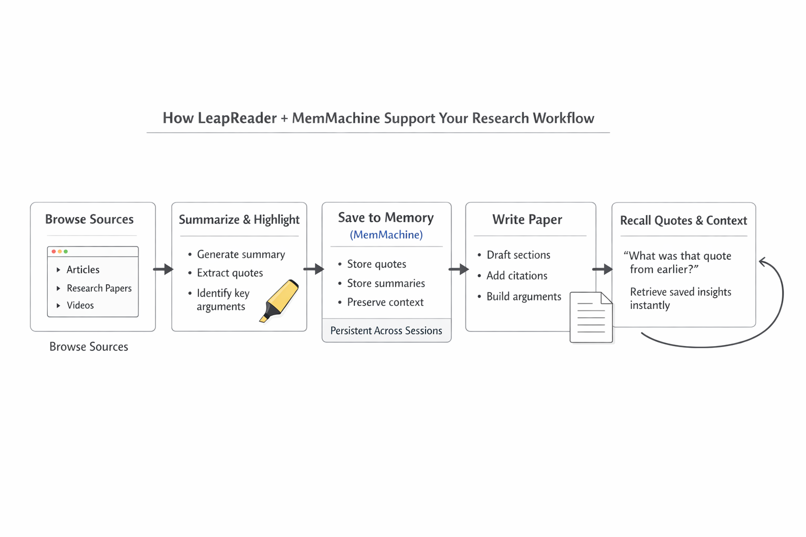

[LeapReader](https://chromewebstore.google.com/detail/leapreader-browse-smarter/kloallkbnddndbdpdoonkopopdafllgo), powered by [MemMachine](https://memmachine.ai), is an AI-powered Chrome extension that helps you read, understand, and extract insights from web content more efficiently. Whether you're conducting academic research, staying current with industry developments, or simply learning faster, LeapReader streamlines your digital reading experience.

## About LeapReader

### Key Features

- AI-powered summarization: Instantly condense long articles, papers, or web pages into clear, concise summaries using top-tier large language models.
- Video Summaries: Support for YouTube and Bilibili—generate full-video overviews, segment summaries, and timestamp-based jump links.
- Intelligent context detection: Automatically analyzes webpage content to enhance AI-powered reading assistance performance.
- Highlighting and extraction: Quickly highlight key sentences and extract vital information for notes, research, or personal reference.
- Multiple AI backend support: Choose from DeepSeek, Doubao, Kimi and other supported models to customize your AI reading assistant based on preference or region.
- Seamless UI integration: Access all functionalities via an elegant side panel, floating button, and convenient right-click menus for fluid, responsive interaction.

## Built for Complicated Workflows

For students and researchers, LeapReader addresses a critical challenge: managing information across dozens of sources over extended timeframes.

Traditional approaches often involve:

- Opening multiple tabs
- Manually copying quotes
- Losing track of reviewed sources

With LeapReader:

- Instantly summarize papers as you browse
- Save important quotes or insights into memory
- Maintain context across multiple documents

When writing, you can recall saved quotes and summaries without searching through tabs or files. This creates a seamless **research-to-writing pipeline** that maintains continuity throughout your project.

Take for example, you are doing research to write a paper. You have multiple tabs open and want to use quotes for your various sources to add to your paper. LeapReader's extension can help you look for relevant quotes within the article.
When writing the paper, you can ask LeapReader to remind you the quotes and add it into your paper. This can streamline the entire research and writing process. This is only possible with the memory from MemMachine. MemMachine helps to store
the chat logs to be referenced for later.

## Powered by MemMachine

LeapReader's persistent capabilities are powered by **MemMachine**, an open-source memory layer that provides true continuity across browsing sessions.

Unlike traditional AI tools that treat each interaction in isolation, MemMachine retains your research context over time through dual memory systems:

- **Episodic Memory** — saves browsing history and extracted content
- **Profile Memory** — learns your reading patterns and preferences

This architecture transforms LeapReader from a simple summarization tool into an intelligent research assistant that evolves with your needs.

The system is model-agnostic, supporting major LLMs while keeping your data under your control through on-premises or private cloud deployment options.

## Privacy and Accessibility

LeapReader operates primarily within your browser, transmitting content to AI providers only when you explicitly request assistance. Your reading history and research data remain private and secure. The intuitive side panel and context menu interface provide powerful capabilities without cluttering your workspace.

## Get Started

LeapReader is available through the Chrome Web Store. Install the extension and begin reading smarter immediately — no complex setup required. MemMachine is used in LeapReader by default.

- [Download LeapReader](https://chromewebstore.google.com/detail/leapreader-browse-smarter/kloallkbnddndbdpdoonkopopdafllgo)
- [Learn More About MemMachine](https://memmachine.ai/)
